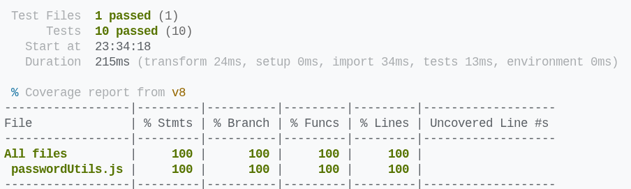

# Password Generator

A simple JavaScript password generator with options for **uppercase letters, numbers, and symbols**.

## Unit Tests

- `arrayFromLowToHigh` – returns ordered number arrays and handles invalid ranges  
- `generatePassword` – returns strings of correct length, includes requested character types  

## Coverage

All pure functions are fully tested, achieving **100% coverage**:



## Run Tests

```bash
npm install
npm run test
npm run test:coverage
```